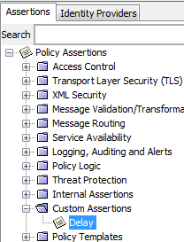
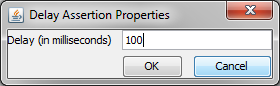

# About
This assertion adds a delay of X milliseconds to a policy. It effectively behaves as a sleep action during policy execution. It is intended be used for development and testing purposes only - not production.

# Build
In order to build the assertion run `gradle build`.

This will compile, test, and create the jar file. It will be available in `build/libs`

# Adding Libraries
In order to build the custom assertion, the Layer7 API Gateway API jar is required to be put into the lib directory.

# Run
Docker version of Gateway greatly helps us to deploy assertions / RESTMAN bundles quickly. Please follow the steps below to run the container Gateway prepopulated with this example assertion and example services.
1) Open Shell or Command Prompt and navigate to the directory where this repository is cloned.
2) Build the Assertion
   ```
     gradle build
   ```
3) Ensure your docker environment is properly setup. 
4) Provide the Layer7 API Gateway license at `docker/license.xml`.
5) Execute the below docker-compose command to run the Layer7 API Gateway container.
   ```
     docker-compose up
   ```
   * Provided `docker-compose.yml` ensures pulling the latest Layer7 API Gateway image from the Docker Hub public repository and deploys the assertion that was just build.
   * In addition, it publishes one service using [delay.req.bundle](docker/delay.req.bundle) RESTMAN bundle.
     * delay [/delay] Service: Sleeps for the amount of milliseconds given in the `delay` query parameter.
6) Wait until the Gateway container is started and is ready to receive messages.

# Usage
To add a delay to any given policy, open the policy in the Policy Manager and look for the custom assertion named **Delay** in the upper left assertion palette:



Drag and drop the **Delay** assertion to the policy editor palette. This will prompt the operator to enter the amount of delay in milliseconds. The user can enter either a positive integer or a context variable in the format `${variable}`.



The given time will be added as a delay on every incoming request that hits the given policy branch.